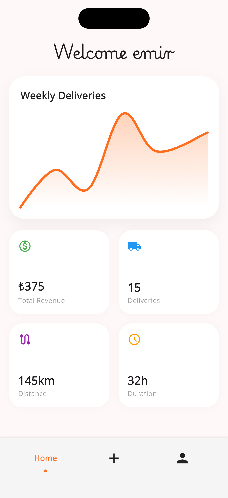
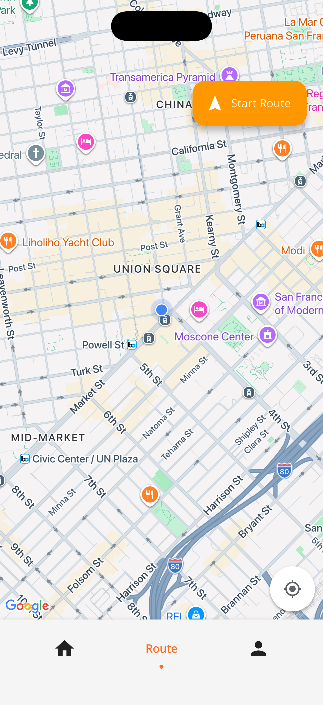
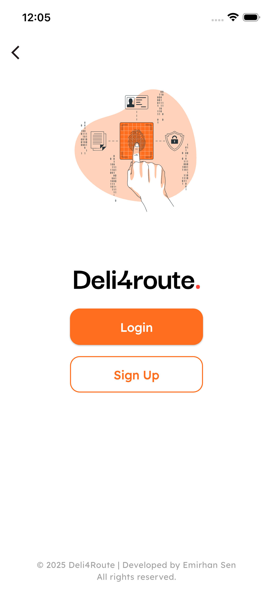
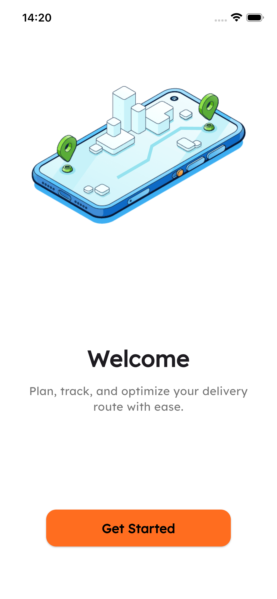
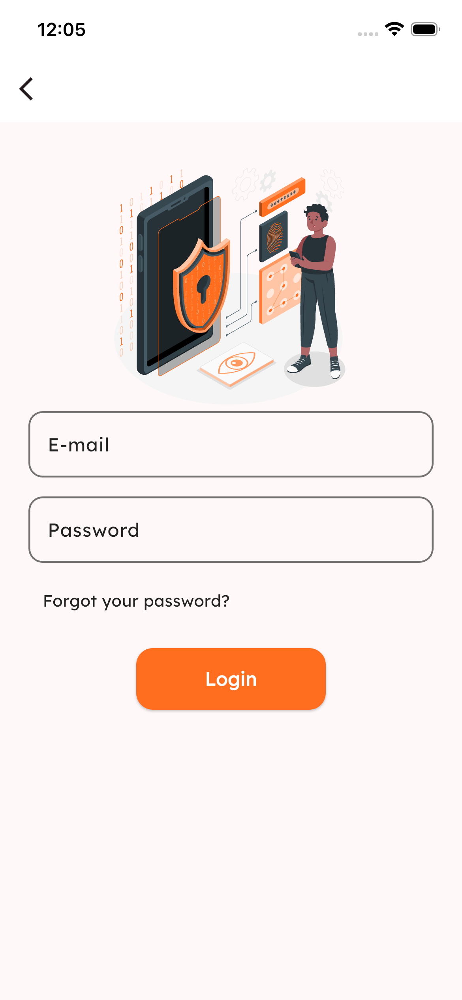
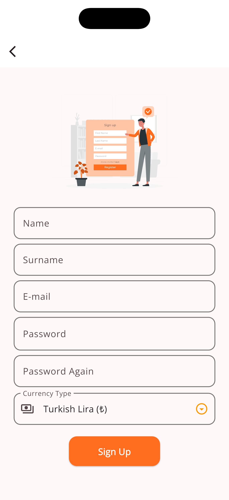
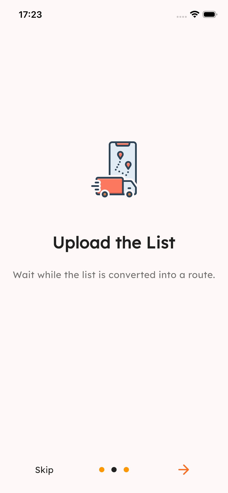
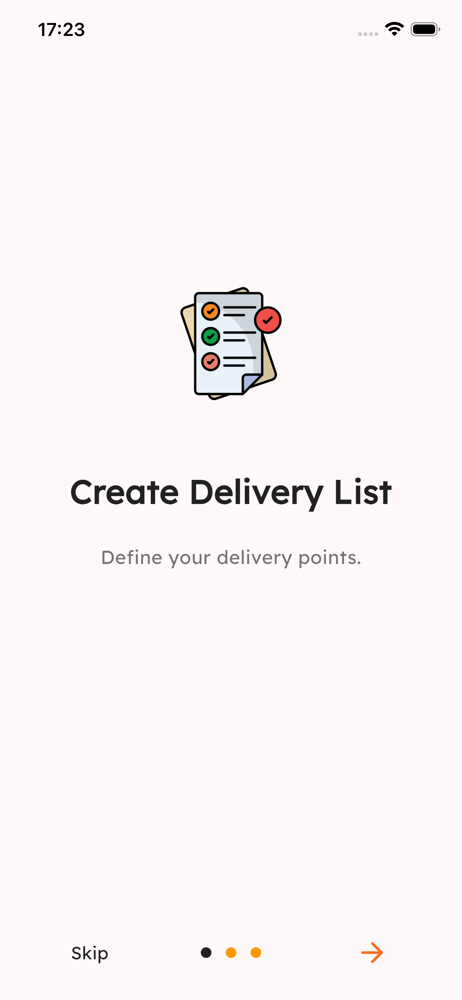

# Deli4Route – Smart Delivery & Route Management Application

Deli4Route is a modern and user-friendly **Flutter mobile application** developed for couriers, small delivery companies, and field teams.  
The goal is to make delivery operations faster, more organized, and more efficient.

---

## 🚀 Key Features

- **Create Delivery List**  
  Couriers can manually enter daily packages.  
  (Future: Automatic importing through OCR or API)

- **Smart Route Generation (Coming Soon)**  
  Suggests the most optimal delivery order based on locations.

- **Navigation Support (Coming Soon)**  
  One-tap redirection to the preferred navigation app.

- **Delivery Status Updates**  
  Packages can be marked as delivered, failed, or canceled.

- **AI-Powered Package Recognition (Planned)**  
  Automatically extracts package information using barcode, QR, or label images.

---

## 🧱 Tech Stack

The app is developed using **Flutter & Dart**.

- **State Management:** Provider  
- **Theme:** Material 3 + custom color set  
- **Data Storage:** Firebase Cloud Firestore
- **Maps:** Google Maps 
- **API:** Not integrated yet (planned)

---

## 📂 Project Folder Structure
```text

lib/
├── core/
│   ├── colors/
│   │   └── app_colors.dart
│   ├── excel/
│   │   └── excel_parser.dart
│   ├── geocoding/
│   │   └── geocoding_service.dart
│   ├── services/
│   │   └── directory_file.dart
│   └── theme/
│       └── app_borders.dart
│
├── features/
│   ├── auth/
│   │   ├── pages/
│   │   │   ├── reset-password/
│   │   │   │   ├── forgot_password.dart
│   │   │   │   ├── new_password.dart
│   │   │   │   └── verify_page.dart
│   │   │   ├── auth_landing_page.dart
│   │   │   ├── login_page.dart
│   │   │   └── signup_page.dart
│   │   └── widgets/
│   │
│   ├── home/
│   │   ├── pages/
│   │   │   ├── create_route_page.dart
│   │   │   └── home_page.dart
│   │   └── widgets/
│   │       ├── home_line_chart.dart
│   │       └── stat_card.dart
│   │
│   ├── navigation/
│   │   ├── pages/
│   │   │   ├── app_shell.dart
│   │   │   ├── edit_profile.dart
│   │   │   ├── history_page.dart
│   │   │   ├── profile_page.dart
│   │   │   └── route_page.dart
│   │   └── providers/
│   │       └── navigation_provider.dart
│   │
│   ├── onboarding/
│   │   └── pages/
│   │       ├── onboarding_page.dart
│   │       ├── splash_screen.dart
│   │       └── welcome_page.dart
│   │
│   └── routes/
│       ├── models/
│       │   ├── delivery_stop.dart
│       │   └── route_cards_model.dart
│       └── widgets/
│
├── firebase_options.dart
└── main.dart
```

---

## 📸 Screenshots

<p align="center">
  
  
  
  
  
  
  
  
  
  
</p> 

---

## 📅 Roadmap

### ✅ Completed
- Project setup  
- Page structure  
- Splash & onboarding  
- UI components  
- Color management
- Home page design
- Firebase Firestore
- Map & navigation integration
- User profile  

### 🛠 In Progress
- Route creation flow  

### 🚧 Planned
- OCR-based package scanning  
- Route optimization algorithms  
- Business modules

---

## 🧪 Running the Project

flutter pub get
flutter run

---

## 👤 Developer

**Emirhan Sen**  
Flutter Developer • Mobile Applications & Technology  

GitHub: https://github.com/emirhansen  
LinkedIn: [emirdmg](https://www.linkedin.com/in/emirdmg/)

---

## ⭐ Support

You can support the project by leaving a ⭐ star.  
The application is actively under development.

---

# 🇹🇷 Deli4Route – Akıllı Teslimat ve Rota Yönetim Uygulaması

Deli4Route, kuryeler, küçük kargo işletmeleri ve saha ekipleri için geliştirilmiş modern ve kullanıcı dostu bir **Flutter mobil uygulamasıdır**.  
Amaç: Teslimat süreçlerini daha hızlı, düzenli ve verimli hale getirmek.

---

## 🚀 Öne Çıkan Özellikler

- **Teslimat Listesi Oluşturma**  
  Kuryeler günlük paketlerini uygulamaya manuel ekleyebilir.  
  (İlerleyen aşamada: OCR veya API ile otomatik aktarma)

- **Akıllı Rota Oluşturma (Yakında)**  
  Konumlara göre en uygun teslimat sırasını öneren algoritma.

- **Navigasyon Desteği (Yakında)**  
  Harita uygulamasına tek dokunuşla yönlendirme.

- **Teslimat Durumu Güncelleme**  
  Teslim edildi, teslim edilemedi, iptal gibi durumlar eklenebilir.

- **AI Destekli Paket Tanıma (Planlanıyor)**  
  Barkod, QR veya etiket fotoğrafından paket bilgilerini otomatik algılama.

---

## 🧱 Teknik Yapı

Uygulama **Flutter & Dart** teknolojileri ile geliştirilmektedir.

- **State Management:** Provider  
- **Tema:** Material 3 + özel renk seti  
- **Veri Saklama:** Firebase Cloud Firestore
- **Haritalar:** Google Maps  
- **API:** Henüz eklenmedi (yakında eklenecek)

---

## 📂 Proje Klasör Yapısı

```text

lib/
├── core/
│   ├── colors/
│   │   └── app_colors.dart
│   ├── excel/
│   │   └── excel_parser.dart
│   ├── geocoding/
│   │   └── geocoding_service.dart
│   ├── services/
│   │   └── directory_file.dart
│   └── theme/
│       └── app_borders.dart
│
├── features/
│   ├── auth/
│   │   ├── pages/
│   │   │   ├── reset-password/
│   │   │   │   ├── forgot_password.dart
│   │   │   │   ├── new_password.dart
│   │   │   │   └── verify_page.dart
│   │   │   ├── auth_landing_page.dart
│   │   │   ├── login_page.dart
│   │   │   └── signup_page.dart
│   │   └── widgets/
│   │
│   ├── home/
│   │   ├── pages/
│   │   │   ├── create_route_page.dart
│   │   │   └── home_page.dart
│   │   └── widgets/
│   │       ├── home_line_chart.dart
│   │       └── stat_card.dart
│   │
│   ├── navigation/
│   │   ├── pages/
│   │   │   ├── app_shell.dart
│   │   │   ├── edit_profile.dart
│   │   │   ├── history_page.dart
│   │   │   ├── profile_page.dart
│   │   │   └── route_page.dart
│   │   └── providers/
│   │       └── navigation_provider.dart
│   │
│   ├── onboarding/
│   │   └── pages/
│   │       ├── onboarding_page.dart
│   │       ├── splash_screen.dart
│   │       └── welcome_page.dart
│   │
│   └── routes/
│       ├── models/
│       │   ├── delivery_stop.dart
│       │   └── route_cards_model.dart
│       └── widgets/
│
├── firebase_options.dart
└── main.dart
```

---

## 📸 Ekran Görüntüleri

<p align="center">
  
  
  
  
  
  
  
  
  
  

</p>

---

## 📅 Yol Haritası (Roadmap)

### ✅ Tamamlandı
- Proje kurulumu  
- Sayfa yapısı  
- Splash & Onboarding  
- UI bileşenleri  
- Renk yönetimi  
- Ana sayfa tasarımı  
- Firebase Firestore
- Harita entegrasyonu
- Kullanıcı profili  

### 🛠️ Yapım Aşamasında:  

- Rota oluşturma akışı  

### 🚧 Planlanan:  
- OCR  
- Rota optimizasyon algoritmaları  
- İşletmelere özel modüller

---

## 🧪 Projeyi Çalıştırma

flutter pub get
flutter run

---

## 👤 Geliştirici

**Emirhan Sen**  
Flutter Developer • Mobil Uygulamalar & Teknoloji  

GitHub: https://github.com/emirhansen  
LinkedIn: [emirdmg](https://www.linkedin.com/in/emirdmg/)

---

## ⭐ Destek Ol

Projeye ⭐ yıldız bırakarak destek olabilirsin.  
Uygulama aktif geliştirilme aşamasındadır.